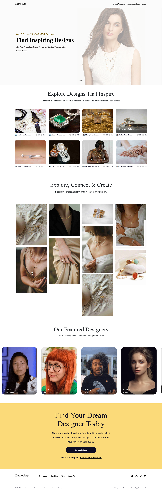

# Social Networking & Skills Portfolio Website for Jewelry Designers

This repository provides a Laravel 10 and Bootstrap application designed for jewelry designers to showcase their work and connect with others. The design inspiration comes from Dribbble

## Getting Started

### Clone the Repository

Clone the repository using the following command:

```bash
git clone https://github.com/arslanstack/jewelry-designers-portfolio-site.git
```
### Installation

After cloning the project, navigate into the project directory and install dependencies:

```bash
cd /ewelry-designers-portfolio-site
```

### Running the Application

Start the Laravel server and compile assets:

```bash
php artisan serve
```

### Contributing

After implementing a feature or fix, use the following commands to commit and push your changes:

```bash
git add .
git commit -m "Describe the feature"
git push -u origin
```


